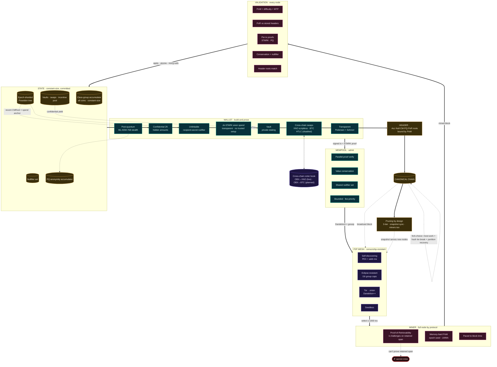
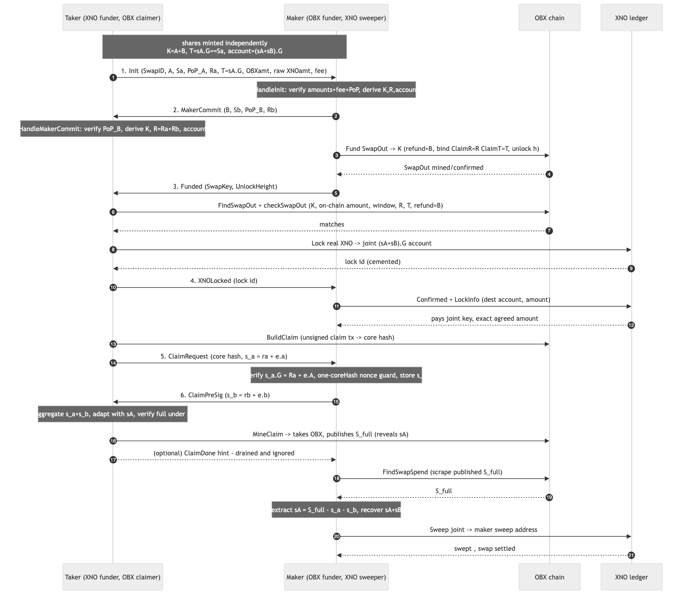
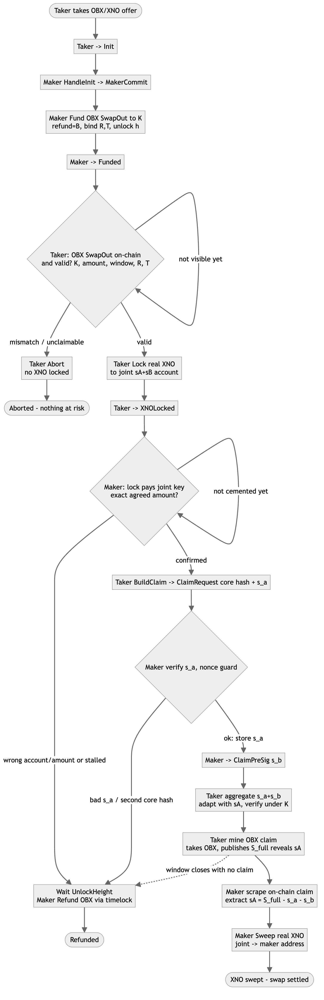

# Obscura (OBX)

**A privacy cryptocurrency with a *global* anonymity set.**

Obscura is a Monero-alternative privacy coin written in Go. Instead of hiding each spend among a small, fixed ring of decoys, Obscura proves — in zero knowledge — that the output you are spending is a member of a **trustless cryptographic accumulator** that contains the *entire unspent-output set of the chain*. The anonymity set is therefore the whole UTXO set: it is global, it grows with every new user, and the membership proof stays **constant size** and **fast to verify** no matter how large that set becomes. Amounts are hidden with Pedersen commitments and range proofs; recipients are hidden with dual-key stealth addresses. The whole system compiles to a single static binary per platform.

> ⚠️ **Obscura mainnet is live.** This is new, novel software: review it yourself before you rely on it.
> Obscura combines well-studied cryptographic primitives in novel ways, and novelty is exactly where cryptographic systems fail. A four-track adversarial security review was performed in-house and its ~100 findings remediated, see **[docs/SECURITY_AUDIT.md](docs/SECURITY_AUDIT.md)**; it has not yet had an external third-party audit. The consensus spend path uses a **confidential-transaction model** (authenticated ownership + value-binding equality proofs + a UTXO spent-set): amounts and recipients are private, but the sender↔output link is revealed. The accumulator-based **sender-anonymity** ZK spend (the headline guarantee) ships as an *experimental* layer that is still being hardened. PoW is canonical, KAT-verified **RandomX** (Monero-compatible, pure-Go P2Pool port), which is the default build; the legacy prototype VM is opt-in only via `-tags protopow`, and a node refuses to start on it without `OBX_ALLOW_PROTOTYPE_POW=1`. Network privacy: Dandelion++ tx-origin privacy ([docs/INVENTION_DANDELION.md](docs/INVENTION_DANDELION.md)) and **optional Tor transport** (`--tor-proxy`/`--onion-address`, [docs/INVENTION_TOR.md](docs/INVENTION_TOR.md)). Fork choice / reorg is implemented: most-cumulative-work with lowest-hash tie-break and bounded-depth finality; see [docs/INVENTION_FORKCHOICE.md](docs/INVENTION_FORKCHOICE.md). As with any new cryptocurrency, understand the software before committing value to it.

> 🔒 **Source kept private.** This repository is kept private: do not push it to a public remote and do not create remotes. The binaries built from it run on the live Obscura mainnet.

> 🌐 **Hosted-wallet trust model.** The static web wallet, when used against a *hosted* node (rather than your own), routes every request through **one operator's node**: that operator and the hosting provider can observe your IP, balance scans, and swap activity, which weakens the on-chain privacy. Public swap-taking is disabled on hosted nodes by default (it would lock the operator's XNO, not yours — set `OBX_PUBLIC_SWAPS=1` only on a mock/demo node). For real privacy and self-custody, **run your own node** (the `--ui` desktop app). See **[docs/GO_LIVE_CHECKLIST.md](docs/GO_LIVE_CHECKLIST.md)** and **[docs/NEW_USER_CRITICAL_ISSUES.md](docs/NEW_USER_CRITICAL_ISSUES.md)**.

---

## Protocol at a glance

The whole protocol on one page — a transaction's path (solid arrows) and the cross-links that make it interconnected (dotted):



## Cross-chain atomic swap (OBX↔XNO)

A scriptless 2-of-2 adaptor swap — no bridge, no custodian: the maker funds OBX first, the taker locks real XNO, and publishing the OBX claim signature reveals the taker's XNO secret, which lets the maker independently sweep the XNO. Both legs settle atomically off one shared secret.



The same swap as a BPMN process flow:



---

## Features

- **Global anonymity set.** Every spend is hidden among *all* unspent outputs, not a ring of ~16 decoys. No decoy selection, so no decoy-selection leakage.
- **Constant-size, fast proofs.** Accumulator membership proofs are succinct and verify in O(log) work regardless of UTXO-set size.
- **No trusted setup (class-group backend).** The accumulator runs over a group of unknown order. The imaginary-quadratic **class-group** backend needs no setup at all; an **RSA-2048** backend is offered as a faster, nothing-up-my-sleeve alternative. The class-group backend is the default.
- **Confidential amounts.** Pedersen commitments + bit-decomposition range proofs hide values while proving conservation.
- **Hidden recipients.** Monero-style dual-key stealth addresses; your address never appears on-chain.
- **Privacy that strengthens with adoption.** Because the anonymity set *is* the UTXO set, every new user makes every existing user more private.
- **Fair launch: no premine, no dev fund.** The genesis block mints zero; 100% of the ~18.4M-OBX supply is created by the block reward from height 1 onward (smooth `remainingSupply >> 19` decay, ~35 OBX initial, perpetual 0.6 OBX/block tail). There is no founder allocation and no dev tax.
- **Three incentive pillars.** Mining reward, a holding-incentive pool (funded by ~5% of each block reward), and a capped/decaying referral bonus for viral growth. See [docs/TOKENOMICS.md](docs/TOKENOMICS.md).
- **Single static binaries.** Pure Go, CGO disabled — cross-compiles to Windows (`.exe`), macOS, and Linux with no runtime dependencies.
- **Batteries included.** Full node, built-in CPU miner, and a CLI wallet.

### Wallet features

A full-featured CLI wallet (`cmd/obscura-wallet`):

- **Encrypted at rest** — seed *and* scan state sealed with Argon2id + XChaCha20-Poly1305 (`new --passphrase`, `passwd` to set/rotate). See [docs/INVENTION_KEYSTORE.md](docs/INVENTION_KEYSTORE.md).
- **Mnemonic backup** — 24-word checksummed seed phrase (`mnemonic` / `restore`). See [docs/INVENTION_MNEMONIC.md](docs/INVENTION_MNEMONIC.md).
- **Base58 checksummed addresses** — typo-resistant, ~94 chars (vs 128 hex), still accepts hex. See [docs/INVENTION_ADDRESS.md](docs/INVENTION_ADDRESS.md).
- **Subaddresses** — unlimited unlinkable receive addresses from one seed (`subaddress`). See [docs/INVENTION_SUBADDRESS.md](docs/INVENTION_SUBADDRESS.md).
- **View-only / watch wallets** — export a view key so an auditor sees incoming funds but cannot spend (`viewkey` / `watch`). See [docs/INVENTION_VIEWONLY.md](docs/INVENTION_VIEWONLY.md).
- **Payment proofs** — prove you received *or* sent a specific payment via a DLEQ, verifiable offline (`proof` / `proofsent` / `checkproof`). See [docs/INVENTION_TXPROOF.md](docs/INVENTION_TXPROOF.md).
- **Dynamic fees + RBF** — node-side fee estimation (`feerate`, `send --fee auto`), fee-aware block selection, and replace-by-fee bumping (`bump`) with sent-payment history (`history`). See [docs/INVENTION_FEES.md](docs/INVENTION_FEES.md).
- **Sweep** — send the entire balance / consolidate (`sweep`).
- **Incremental scan** — persistent state scans only new blocks instead of rescanning from genesis.
- **Atomic-swap order book** — list/post OBX↔XNO (Nano) swap offers (`offers` / `offer`). See [docs/INVENTION_SWAPS.md](docs/INVENTION_SWAPS.md).

---

## How it's different from Monero

| Dimension | Monero | Obscura |
|---|---|---|
| Anonymity set | Bounded ring (~16 decoys) | **Global** — the entire UTXO set |
| Set growth | Fixed | Grows with adoption |
| Proof size vs. set | Linear in ring size | **Constant** |
| Verifier cost vs. set | Linear in ring size | **O(log)** |
| Decoy-selection leakage | Yes (heuristic distribution) | **None** (no decoys) |
| Trusted setup | None | **None** (class-group backend) |
| Amount privacy | RingCT (Bulletproofs) | Pedersen + range proofs |
| Group operations | ECC (fast) | Class group (slower) / RSA |

A deeper, honest comparison — including the costs (class-group speed, witness maintenance, the heavier full ZK spend) — is in the [whitepaper](WHITEPAPER.md).

---

## Build

Requires **Go 1.24+** (the module targets Go 1.25).

From the repository root:

```bash
# Node (full node + built-in miner)
go build -o bin/obscura-node ./cmd/obscura-node

# Wallet (CLI)
go build -o bin/obscura-wallet ./cmd/obscura-wallet

# Standalone CPU miner (mines against any node's RPC)
go build -o bin/obscura-miner ./cmd/obscura-miner
```

This produces three binaries in `bin/`. The miner is optional — the node has a
built-in `--mine` flag — but it lets anyone mine to a node without running one:

```bash
./bin/obscura-miner --node http://127.0.0.1:18081 --address <your-address>
```

### Proof-of-work backend

By default the plain build (`go build`, `make`, `./build.sh`, no tags) produces
**canonical, Monero-compatible RandomX**: the pure-Go [P2Pool go-randomx] port
(still CGO-free, so it cross-compiles to a static `.exe`), verified against the
official RandomX known-answer vectors. No build tag is needed:

```bash
go build -o bin/obscura-node ./cmd/obscura-node
```

To select Obscura's self-contained, pure-Go **RandomX-style prototype VM**
instead (light and fast, ideal for fast dev/test iteration, but insecure and
near-zero memory-hardness), add `-tags protopow`:

```bash
go build -tags protopow -o bin/obscura-node ./cmd/obscura-node
```

A node on the prototype backend refuses to start unless `OBX_ALLOW_PROTOTYPE_POW=1`
is set (devnets only). The canonical backend is verified against the official
RandomX known-answer vectors, and that KAT test runs by default
(`go test ./pkg/pow/`). `wallet status` and the node startup log
report which backend is active (`randomx-canonical` or `vm-randomx-style`).
Switching the backend changes the PoW hash, so it is a hard fork — pick one per
network. (Note: keep the `go-randomx` require in `go.mod`; the default canonical
backend depends on it.)

[P2Pool go-randomx]: https://git.gammaspectra.live/P2Pool/go-randomx

### Cross-compile all platforms

A `build.sh` cross-compiles both binaries (CGO disabled, single static binaries — including a real Windows `.exe`) for Linux, macOS, and Windows on amd64/arm64, bundles the docs, and writes archives into `dist/`:

```bash
./build.sh
```

A `Makefile` is also provided with convenience targets:

```bash
make build     # build both binaries into bin/
make test      # run the test suite
make release   # cross-compile release archives (wraps build.sh)
make clean     # remove build artifacts
```

---

## Quickstart

The shortest path from zero to a confidential transfer between two wallets is in **[docs/QUICKSTART.md](docs/QUICKSTART.md)**. In brief:

```bash
# 1. create two wallets
./bin/obscura-wallet new --wallet A.seed     # prints Address: <hexA>
./bin/obscura-wallet new --wallet B.seed     # prints Address: <hexB>

# 2. start a node that mines to wallet A
./bin/obscura-node --datadir ./data --mine --mine-address <hexA> &

# 3. watch it grow, check A's balance, then send 5 OBX to B
./bin/obscura-wallet status
./bin/obscura-wallet balance --wallet A.seed
./bin/obscura-wallet send --wallet A.seed --to <hexB> --amount 5 --fee 0.001

# 4. after the next block, B has the coins
./bin/obscura-wallet balance --wallet B.seed
```

For mining details see **[docs/MINING.md](docs/MINING.md)**; for the RPC API see **[docs/RPC.md](docs/RPC.md)**.

### Local testnet

Spin up a multi-node local testnet (separate datadirs/ports, line topology, one
miner) and watch the nodes converge, then a confidential transfer propagate end
to end:

```bash
make testnet N=5      # or: ./scripts/testnet.sh 5
```

A deterministic, CI-able version of the same — N in-process nodes that sync,
propagate live-mined blocks, converge, and deliver a confidential payment across
nodes — lives in `tests/critical/testnet/` (`go test ./tests/critical/testnet/`).

---

## Units & addresses

- **1 OBX = 10¹² atomic units** (12 decimals). The wallet CLI takes/returns decimal OBX (e.g. `5`, `0.001`); consensus accounts in atomic units internally.
- **Addresses are 64-byte hex** — the view key `A` concatenated with the spend key `B` (`A || B`).

---

## Project layout

```
cmd/
  obscura-node/       full node + miner executable
  obscura-wallet/     CLI wallet executable
pkg/
  group/              group of unknown order (RSA + class-group backends)
  accumulator/        dynamic accumulator, hash-to-prime, PoE, NI-PoKE2, non-membership
  commit/             Pedersen commitments, range proofs, conservation, stealth addresses
  tx/                 transaction model (spends, nullifiers, commitments, proofs)
  block/              block headers & bodies, coinbase, referral tag
  pow/                ASIC-resistant proof of work
  chain/              blockchain state machine (accumulator, nullifier set, incentive pool)
  consensus/          difficulty (LWMA), validation rules, chain selection
  mempool/            unconfirmed-transaction pool
  p2p/                peer discovery & gossip
  config/             chain parameters & accumulator-backend selection (params.go)
  rpc/                JSON-over-HTTP node API (server.go) + client (client.go)
  wallet/             keys, scanning, witness tracking, spend construction
build.sh              cross-compile all platforms into dist/
```

---

## Documentation

- **[WHITEPAPER.md](WHITEPAPER.md)** — the full protocol, cryptographic foundations, the private-spend design, the Monero comparison, and a candid "Security Status & Limitations".
- **[docs/ARCHITECTURE.md](docs/ARCHITECTURE.md)** — how the responsibilities map onto packages and how a transaction flows from wallet to chain.
- **[docs/TOKENOMICS.md](docs/TOKENOMICS.md)** — emission curve, tail emission, and the three incentive pillars (mine / hold / share).
- **[docs/QUICKSTART.md](docs/QUICKSTART.md)** — step-by-step getting started.
- **[docs/MINING.md](docs/MINING.md)** — how to mine.
- **[docs/RPC.md](docs/RPC.md)** — RPC API reference.

---

## Economic model (in one paragraph)

Obscura uses a **smooth, decreasing emission curve** (a shift-based decay, not discrete halvings) with a **perpetual tail emission of ~0.6 OBX/block** and a **~18.4M OBX soft cap**, a **120s target block time**, and **LWMA** difficulty retargeting. Emission is split across three reinforcing incentives: the **mining reward** (chain security), a **holding-incentive pool** funded from each block reward (rewards time-locked, committed supply without classic inflation), and a **capped, decaying referral bonus** that turns miners into a distributed growth engine. Full detail, including anti-abuse analysis, is in [docs/TOKENOMICS.md](docs/TOKENOMICS.md).

---

## Disclaimer

Obscura is provided **as is**, with no warranty of any kind. The mainnet is live, but it has not had an external third-party audit and its sender-anonymity ZK layer is still being hardened (see the honesty notes above and in the whitepaper). This is new software: review it yourself and understand the risks before committing value to it.
