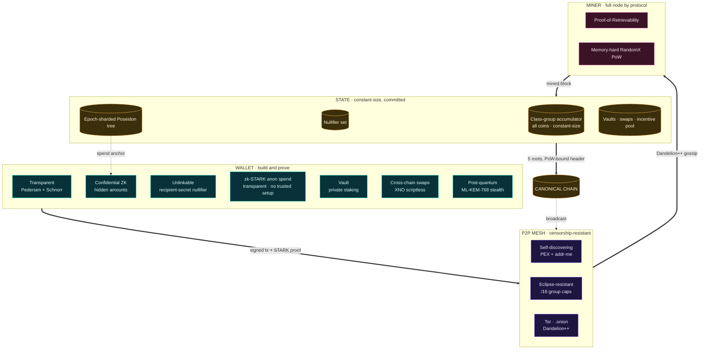

# Obscura (OBX)

**A privacy cryptocurrency with a *global* anonymity set — no decoys, no trusted setup.**

Obscura hides every spend among the **entire** unspent-output set: a zero-knowledge proof shows the spent coin is a member of a trustless cryptographic accumulator over *all* outputs. The anonymity set is global and grows with adoption, while membership proofs stay **constant-size** and fast to verify. Amounts are hidden with Pedersen commitments + range proofs; recipients with dual-key stealth addresses. Pure Go, single static binary per platform, canonical RandomX PoW.

- **Global anonymity set** — every spend hides among all outputs, not a ring of ~16 decoys.
- **No trusted setup** — class-group accumulator (no ceremony) + transparent, post-quantum-friendly zk-STARKs.
- **Confidential amounts & hidden recipients** — Pedersen commitments, range proofs, stealth addresses.
- **Constant-size proofs** regardless of chain size · **fair launch** (no premine, no dev fund).
- **Batteries included** — full node, CPU miner, CLI/desktop wallet, private staking vaults, and trustless OBX↔XNO atomic swaps.

## Protocol at a glance



## Download & run

Get a build for your platform from the **[v1.0.0 release](https://github.com/dhyabi2/obscura/releases/tag/v1.0.0)** (verify against [RELEASES.md](RELEASES.md) checksums). Or install + run a full node + miner in one command — **re-run the same line any time to upgrade** (it verifies the new build's SHA-256, replaces only the binary, and keeps your keys in `~/.obscura`):

```sh
# Linux / macOS
curl -fsSL https://obscura-blush.vercel.app/install.sh | sh

# Windows (PowerShell)
iwr -useb https://obscura-blush.vercel.app/install.ps1 | iex
```

For a desktop wallet + swaps + mining in a window, unzip the macOS/Windows/Linux build and open it.

## Links

- **Website** — https://obscura-blush.vercel.app
- **Whitepaper** — https://obscura-blush.vercel.app/whitepaper
- **Docs** — [docs/](docs/) · https://obscura-blush.vercel.app/docs.html

## Status & disclaimer

New, novel software running a **live mainnet**. An in-house four-track security review (~100 findings remediated) was performed; there is **no external third-party audit yet**, and the accumulator-based sender-anonymity ZK spend is an experimental layer still being hardened. Understand the software before committing value to it.

## License

See [LICENSE](LICENSE).
