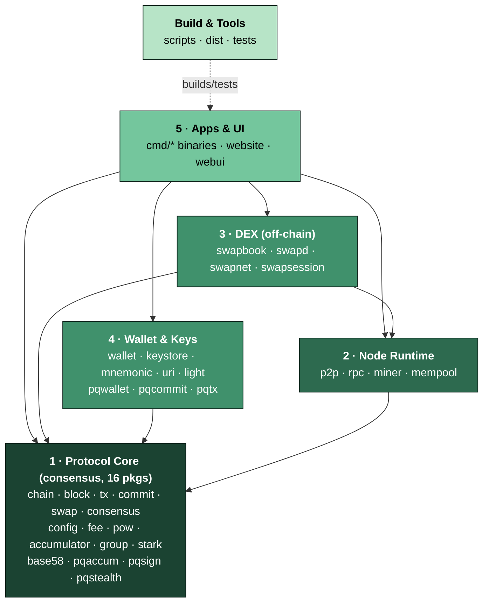

# Obscura, Project Architecture & Boundaries

**Status: AUTHORITATIVE.** Read this before touching anything in the repository.

This document is the map that keeps the protocol solid. It defines the layers, the one
dependency rule that holds them apart, the *protocol surface* that peripheral projects are
allowed to rely on, the build-time couplings that are not Go imports, and an explicit "if
you change X, what you may and may not touch" table.

If anything here conflicts with the code, the code wins **only** for the consensus core , 
and that means the document is wrong and must be fixed in the same change. For everything
else, this document is the intended design; code that violates it is a bug.

Companion docs: [`ARCHITECTURE.md`](ARCHITECTURE.md) (tx-flow narrative),
[`GO_LIVE_CHECKLIST.md`](GO_LIVE_CHECKLIST.md) (mainnet launch),
[`WHITEPAPER.md`](WHITEPAPER.md) (protocol theory).

---

## 0. TL;DR for the impatient contributor

- Single Go module **`obscura`** (`go.mod` at repo root, Go 1.25). 82 packages total.
- The **consensus core is exactly 16 packages**, the full transitive import closure of
  `pkg/chain`. It imports **nothing** from any peripheral / node / DEX / wallet / UI package.
- **The one rule:** dependencies point **downward only** (Apps → Wallet/DEX/Node → Core).
  Nothing the core imports may import anything outside the core. **Enforced by a guard test.**
- Changing the **protocol surface** (consensus params, tx/header formats, public core types)
  is a **fork**. It is never a refactor, never a "small fix", never a peripheral concern.
- Several couplings are **not Go imports** (website embed copy, WASM build, desktop
  packaging, whitepaper render). They need manual coordination, see §6.

---

## 1. Layer diagram

Seven layers. A layer may depend only on layers **below** it. The arrows are the *only*
permitted dependency directions.



**Reading the diagram:** every arrow goes toward the core. There is no arrow leaving the
core. That single fact is what makes the protocol auditable in isolation.

### Layer → folder mapping (authoritative)

| Layer | Folders / packages | Role |
|---|---|---|
| **1 · Protocol Core** *(consensus)* | `pkg/`: `accumulator`, `base58`, `block`, `chain`, `commit`, `config`, `consensus`, `fee`, `group`, `pow`, `pqaccum`, `pqsign`, `pqstealth`, `stark`, `swap`, `tx` | Consensus rules & on-chain data structures: emission, block/header validation, tx formats, confidential amounts (ZK range proofs), on-chain swap outputs, PoW/PoR, accumulators, post-quantum primitives. **This is the protocol.** |
| **2 · Node Runtime** | `pkg/`: `p2p`, `rpc`, `mempool`, `miner` *(plus `light` is wallet-side SPV, see Wallet)* | The running node: Dandelion++ gossip, JSON-RPC API, mining (PoW/PoR solver), mempool. Policy & networking, **not** consensus. |
| **3 · DEX (off-chain)** | `pkg/`: `swapbook`, `swapd`, `swapnet`, `swapsession` | Off-chain swap coordination: order book, matching daemon, P2P order dissemination, swap session state. The *on-chain* swap type lives in core (`pkg/swap`); this layer is the coordination around it. |
| **4 · Wallet & Keys** | `pkg/`: `wallet`, `keystore`, `mnemonic`, `uri`, `light`, `pqwallet`, `pqcommit`, `pqtx` | Key storage, HD mnemonics, address/URI encoding, SPV light sync, PQ wallet keys/commitments. Builds & signs transactions; never validates the chain for others. |
| **5 · Apps & UI** | `cmd/`: `obscura-node`, `obscura-miner`, `obscura-wallet`, `obscura-swap`, `obscura-wasm`, `obscura-dashboard`, `obscura-dexsim`, `obscura-loadgen`, `obscura-testwallet`. UI sources: `website/`, `webui/` | Executables and web/desktop UIs. Wire the layers together; hold no protocol logic of their own. |
| **Build & Tools** | `scripts/`, `dist/`, `tests/` | Cross-compile & packaging (`scripts/package-desktop.sh`), whitepaper render, load tests, critical integration tests (`tests/critical/`). Consume the apps; never imported by them. |
| **Docs** | `docs/` | This file, `ARCHITECTURE.md`, `WHITEPAPER.md`, `GO_LIVE_CHECKLIST.md`, invention notes, audits. No code depends on docs. |

> **Note on `pkg/light`:** it is SPV/wallet-side sync (no full block bodies), grouped with
> Wallet & Keys. The original layering JSON listed it under node-runtime; functionally it
> serves wallets and imports only core. Either grouping respects the one rule.

---

## 2. The ONE dependency rule

> **Dependencies point downward only. No package in the consensus core may import any
> package outside the consensus core.**

Equivalently: **the consensus core is a closed set.** Its transitive import closure (within
this module) is exactly itself, the 16 packages listed in Layer 1. Peripheral layers
(node, DEX, wallet, apps, build) may freely import the core and each other within the
permitted downward direction, but the core never reaches up.

Why this is the whole game:
- The protocol can be audited by reading **16 packages**, with a hard guarantee that no UI,
  wallet, RPC, or DEX code can sneak a consensus-affecting change in through a back edge.
- A peripheral bug (explorer, swap daemon, packaging) can **never** force a fork.
- The only `core → feature-looking` edge is `pkg/chain → pkg/swap`. This is **not** a
  violation: `pkg/swap` is the on-chain `SwapOutput` consensus type and imports only
  `commit` + `config`. On-chain swaps are part of consensus, not the off-chain DEX layer.

### 2.1 How it is ENFORCED, the guard test

The rule is mechanically enforced by a Go test that recomputes the core's import closure and
fails if it ever grows beyond the 16 allowed packages. **This test must stay green; a red
guard test blocks merge.**

Add it at `tests/critical/layering/layering_test.go`:

```go
package layering

import (
	"os/exec"
	"sort"
	"strings"
	"testing"
)

// CoreClosure is the authoritative consensus core: the exact transitive
// import closure of pkg/chain within module "obscura". It changes ONLY via a
// deliberate protocol fork (and a matching edit to docs/PROJECT_ARCHITECTURE.md).
var CoreClosure = map[string]bool{
	"obscura/pkg/accumulator": true,
	"obscura/pkg/base58":      true,
	"obscura/pkg/block":       true,
	"obscura/pkg/chain":       true,
	"obscura/pkg/commit":      true,
	"obscura/pkg/config":      true,
	"obscura/pkg/consensus":   true,
	"obscura/pkg/fee":         true,
	"obscura/pkg/group":       true,
	"obscura/pkg/pow":         true,
	"obscura/pkg/pqaccum":     true,
	"obscura/pkg/pqsign":      true,
	"obscura/pkg/pqstealth":   true,
	"obscura/pkg/stark":       true,
	"obscura/pkg/swap":        true,
	"obscura/pkg/tx":          true,
}

// TestCoreIsClosed asserts that pkg/chain's transitive (non-test) import
// closure is EXACTLY the 16-package consensus core, no more, no less. A new
// import that pulls a peripheral package into the core fails here.
func TestCoreIsClosed(t *testing.T) {
	out, err := exec.Command("go", "list", "-deps", "obscura/pkg/chain").Output()
	if err != nil {
		t.Fatalf("go list -deps: %v", err)
	}
	got := map[string]bool{}
	for _, p := range strings.Fields(string(out)) {
		if strings.HasPrefix(p, "obscura/") { // module-internal only
			got[p] = true
		}
	}
	// Extra: anything in the closure that is not allowed = an upward edge.
	var extra, missing []string
	for p := range got {
		if !CoreClosure[p] {
			extra = append(extra, p)
		}
	}
	for p := range CoreClosure {
		if !got[p] {
			missing = append(missing, p)
		}
	}
	sort.Strings(extra)
	sort.Strings(missing)
	if len(extra) > 0 {
		t.Fatalf("consensus core LEAKED upward, these peripheral packages entered "+
			"pkg/chain's closure: %v\nIf this is an intentional fork, update CoreClosure "+
			"AND docs/PROJECT_ARCHITECTURE.md in the same change.", extra)
	}
	if len(missing) > 0 {
		t.Fatalf("core shrank, expected packages no longer in closure: %v "+
			"(intentional? update CoreClosure + docs).", missing)
	}
}
```

Run it with `go test ./tests/critical/layering/`. CI runs `go test ./...`, so it is covered
there too. The test uses `go list -deps` (non-test deps), so test-only imports, e.g.
`pkg/chain/*_test.go` importing `pkg/wallet` or `pkg/miner` for integration, are correctly
ignored. Those test edges are fine: production builds never include them.

**The guard test is the contract.** Touching `CoreClosure` is equivalent to declaring a
fork; reviewers treat a diff to that map the same as a diff to `pkg/config/params.go`.

---

## 3. The stable protocol surface

Peripheral projects (explorer, alt-wallets, swap clients, block analyzers, anything
external) may build against the **protocol surface** below. The promise:

> **The protocol surface changes ONLY via a deliberate fork.** It is never altered by an
> isolation refactor, a UI change, a DEX feature, or a bug fix in a peripheral layer. A
> change here means every node must upgrade.

Everything outside this surface, RPC convenience fields, wallet internals, DEX order
formats, packaging, is **not** a stability promise and may change between builds.

### 3.1 Network identity (binds every proof & signature)

Defined in `pkg/config/params.go`. `NetworkSeed` → `netID` (blake2b over
`NetworkSeed‖AccumulatorBackend‖CoinName‖Ticker‖AtomicPerCoin‖ClassGroupDiscriminantBits`).
`netID` is mixed into every CoreHash (tx signatures), every STARK transcript, and every swap
claim/refund signature, giving cross-instance replay protection.

| Surface element | Value | Change class |
|---|---|---|
| `NetworkSeed` → `netID` | `"obscura-mainnet-v1"` → 32-byte derived | **HARD FORK** |
| `CoinName` / `Ticker` | `Obscura` / `OBX` | **HARD FORK** (in netID) |
| `OBX_NETWORK` mode | mainnet / testnet / devnet | NON-CONSENSUS (only gates which knobs are env-overridable) |

### 3.2 Monetary policy & timing

All `const` (immutable) unless noted. Sources in `pkg/config/params.go`.

| Element | Value | Change class |
|---|---|---|
| `AtomicPerCoin` | `1e12` (12 decimals) | **HARD FORK** (in netID) |
| `MoneySupplyCap` | 18.4M OBX (`18_400_000 × 1e12`) | **HARD FORK** |
| `EmissionShift` | 19 (`reward = remaining >> 19`) | **HARD FORK** |
| `TailEmissionAtomic` | 0.6 OBX/block | **HARD FORK** |
| `IncentivePoolBps` | 500 (5% → holding pool) | **HARD FORK** |
| `Holding{Min,Max}Lock` | 10k / 525.6k blocks | **HARD FORK** |
| `TargetBlockTime` | 120 s | **HARD FORK** (mainnet-locked via `IsMainnet()`) |
| `DifficultyWindow` | 60 blocks | **HARD FORK** |
| `MinDifficulty` (`pkg/consensus`) | 16 | **HARD FORK** (floor) |
| `CoinbaseMaturity` | 60 blocks | **HARD FORK** |

### 3.3 PoW / PoR

| Element | Value | Change class |
|---|---|---|
| `PoWGenesisSeed` | `"Obscura/RandomX/epoch0/v1"` | **HARD FORK** |
| `PoWEpochLen` / `PoWSeedLag` | 2048 / 512 blocks | **HARD FORK** |
| `PoRWindow` / `PoRChallenges` | 10_000 blocks / 4 per block | **HARD FORK** |

### 3.4 Accumulators & anonymity

| Element | Value | Change class |
|---|---|---|
| `AccumulatorBackend` | `"classgroup"` | **HARD FORK** (in netID) |
| `ClassGroupDiscriminantBits` | 2048 | **HARD FORK** (in netID) |
| `ConfidentialBits` | 60 (ZK range bound) | **HARD FORK** |
| `PoolSize` | 16 (anonymity ring); **mainnet must be ≥ 64** | **HARD FORK** |

### 3.5 On-chain transaction & block formats

These are the **serialization contract**. Any change to layout, version bytes, or root
derivation is a hard fork; external parsers depend on them byte-for-byte.

- **Tx** (`pkg/tx/tx.go`): `Version` (uint16, big-endian; 1 classical, 2 reserved PQ),
  supported types (`Input`, `AnonInput`, `SwapOut/SwapIn`, `Output`, `ZKInput/ZKOutput`,
  `VaultOut/VaultIn`, `CZKSpend`; PQ: `PQInput/PQOutput`), limits `MaxInputs`/`MaxOutputs`
  =1024, `MaxFieldBytes`=64KiB, `MaxTxBytes`=2MiB.
- **Block header** (`pkg/block/block.go`): `Version`, `MerkleRoot`, and the **five roots** , 
  `AccValue`+`AccSize`, `NullRoot`, `CMRoot`, `PQAccRoot`, `PoRRoot`, all hashed into the
  PoW preimage. `MaxBlockBytes`=2MiB.
- **On-chain swap** (`pkg/swap`): `SwapOutput`, with reorg-safety invariants
  `SwapReorgMargin`=100, `SwapTimelockWindow`=200, `SwapMinClaimWindow`=50;
  `SettleableAssets`=`["OBX","XNO"]`.
- **Fork choice** (`pkg/chain/forkchoice.go`): `MaxReorgDepth`=100,
  `PartitionRecoveryMargin`=100.
- **Address** (`pkg/commit/address.go`): `AddressVersion`=`0x29`, blake2b-256 4-byte
  checksum, Bitcoin-style base58, wallet-side format; breaks cross-version address parsing
  but not on-chain validation.

### 3.6 Public Go types peripheral code may import

External Go projects may import these core packages and depend on their **exported** types:
`pkg/tx` (`Transaction`, input/output types), `pkg/block` (`Header`, `Block`),
`pkg/config` (all exported params), `pkg/commit` (`Address`, commitment helpers),
`pkg/swap` (`SwapOutput`), `pkg/base58`. Treat their exported API as semver-stable within a
protocol version; it changes only on a fork.

> **Mutable `var`s that are secretly consensus-critical.** A few surface values are `var`
> (so tests can shrink them): `PoolSize`, `SwapReorgMargin`, `SwapTimelockWindow`,
> `SwapMinClaimWindow`, `CoinbaseMaturity`, and the env-overridable `TargetBlockTime` /
> `GenesisDifficulty` / `FixedDifficulty`. **Production code (non-test, non-cmd-selftest)
> must never write to these.** On mainnet, `IsMainnet()` locks the env overrides and
> `GO_LIVE_CHECKLIST.md` requires `PoolSize ≥ 64`. Treat each as if it were `const`.

---

## 4. What is NON-consensus (safe to change freely)

These look protocol-ish but are node-local policy. Different nodes may legitimately disagree:
- Auto-liquidity knobs (`AutoSwapLiquidity`, `AutoLiquidityRate`, `AutoLiquidityMaxFraction`, …).
- `MinFeePerByte`, `MinOrderSize`, `SwapMaxSessions*`, mempool/relay/griefing policy.
- `DefaultSeeds` / `OBX_SEEDS`, bootstrap peers.
- Address checksum/base58 display, genesis timestamp (hardcoded, never validated).
- Everything in RPC responses beyond the documented stable fields, all wallet internals, all
  DEX order-book wire formats, all UI.

---

## 5. Network identity & runtime config

`pkg/config/net.go` selects MainNet / TestNet / DevNet via `OBX_NETWORK`. On mainnet,
emission/timing env overrides are **locked** (`IsMainnet()` early-returns in the `init()`
that reads `OBX_TARGET_BLOCK_TIME`, `OBX_GENESIS_DIFFICULTY`, `OBX_FIXED_DIFFICULTY`). The
P2P network magic is derived from `NetworkSeed` at init and is effectively const, keep
`NetworkSeed` a `const`; making it a `var` would risk a silent network split. See
`GO_LIVE_CHECKLIST.md` for the launch runbook (mandatory `OBX_NETWORK=mainnet`, no override
env vars on production nodes, `PoolSize ≥ 64`).

---

## 6. Build-time couplings (NOT Go imports)

These are real dependencies the Go compiler will **not** catch. Each needs manual
coordination, and getting one wrong ships a stale/mismatched artifact.

### 6.1 Website embed copy (desktop node UI)

`cmd/obscura-node/website/` is a **`//go:embed all:website` COPY** of repo-root `website/`,
not a symlink. (`cmd/obscura-node/ui.go`, `main.go --ui`.)

**To update safely:** after editing `website/`, re-sync **before** `go build`:
```bash
rsync -a --exclude='.vercel' --exclude='api' --exclude='*.sh' \
      --exclude='vercel.json' --exclude='.gitignore' \
      website/ cmd/obscura-node/website/
go build ./cmd/obscura-node
```
Risk if skipped: the desktop node serves a stale UI/wallet. Verify the copy is in sync
(hash/timestamp) in mainnet builds.

### 6.2 WASM web wallet

`cmd/obscura-wasm` compiles to `website/wallet.wasm` via `website/build-wasm.sh`:
```bash
GOOS=js GOARCH=wasm go build -trimpath -o website/wallet.wasm ./cmd/obscura-wasm
```
**To update safely:** after any change to `pkg/wallet`, `pkg/commit`, `pkg/block`,
`pkg/tx`, or `cmd/obscura-wasm`, **rebuild `wallet.wasm`** and then re-run the §6.1 rsync (so
the desktop embed gets the new WASM too). Risk if skipped: the web wallet builds/signs
transactions the live chain rejects (format/signature drift). Consider a CI gate that fails
if `wallet.wasm` is out of date relative to those packages.

### 6.3 Dashboard embed

`cmd/obscura-dashboard` embeds `webui/` via `//go:embed`. Rebuild the dashboard binary after
editing `webui/`.

### 6.4 Desktop packaging

`scripts/package-desktop.sh` reads `dist/obscura-app-{darwin,windows,linux}-{amd64,arm64}`
and writes `Obscura-*.{zip,tar.gz}` with OS-specific wrappers, ad-hoc macOS codesigning, and
`SHA256SUMS`. **To update safely:** cross-compile the `dist/` binaries first, then run the
script; verify `SHA256SUMS` after.

### 6.5 Whitepaper render

`docs/WHITEPAPER.md` → `docs/whitepaper.html` via `scripts/render_whitepaper.py`
(Markdown → HTML + MathJax). **To update safely:** edit the `.md`, re-run the renderer,
commit both. Never hand-edit the `.html`. (Same pattern for `docs/ARCHITECTURE.html`.)

---

## 7. "If you change X, what you may and must NOT touch"

The authoritative boundary table. **MUST NOT** items, if touched, require treating the work
as a protocol fork (full-network upgrade + checklist), not a feature change.

| You are changing… | You MAY touch | You MUST NOT touch (without declaring a fork) | Don't forget |
|---|---|---|---|
| **Explorer / block UI** (`website/explorer.html`, charts, RPC read endpoints) | `website/`, read-only `pkg/rpc` response fields | `pkg/block`, `pkg/tx`, `pkg/chain`, header roots, any consensus param | Re-rsync to `cmd/obscura-node/website/` (§6.1) |
| **Wallet** (`pkg/wallet`, `cmd/obscura-wallet`, `obscura-wasm`, keystore, mnemonic, uri) | wallet/keys layer, address *display*, tx *construction* | `pkg/tx` serialization/version, `pkg/commit` on-chain commitment derivation, `ConfidentialBits`, `AddressVersion` (breaks parsing), `CoreHash`/`netID` | Rebuild `wallet.wasm` (§6.2) + re-rsync embed (§6.1) |
| **Swap DEX** (`pkg/swapbook/swapd/swapnet/swapsession`, `cmd/obscura-swap`, `obscura-dexsim`) | off-chain order book, matching, P2P order wire, session policy, `MinOrderSize`, session limits | `pkg/swap` (`SwapOutput`), `SwapReorgMargin`/`SwapTimelockWindow`/`SwapMinClaimWindow`, `SettleableAssets`, on-chain claim/refund height logic in `pkg/chain` | Off-chain ≠ on-chain: the consensus swap type is in core, do not edit it for a DEX feature |
| **Node runtime** (`pkg/p2p/rpc/mempool/miner`, `cmd/obscura-node/miner`) | gossip, RPC handlers, mempool policy, `MinFeePerByte`, `DefaultSeeds`, relay rules | PoW/PoR validation logic, difficulty math (`pkg/consensus`), any block/header validation in `pkg/chain`, `NetworkSeed`/network magic | Keep core read-only; never write consensus `var`s at runtime |
| **Build / packaging** (`scripts/`, `dist/`) | cross-compile flags, bundling, codesign, checksums | binary semantics, embedded artifacts' *content* (rebuild them properly instead of patching) | Cross-compile `dist/` first; regenerate `SHA256SUMS`; re-rsync embed + rebuild WASM if UI/wallet changed |
| **Whitepaper / docs** (`docs/*.md`) | any `.md` prose | nothing in code | Re-run `render_whitepaper.py`; commit `.md` **and** generated `.html` together |
| **Consensus core** (`pkg/config/params.go`, `block`, `tx`, `chain`, `swap`, `consensus`, `commit`, `pow`, `stark`, `accumulator`, `group`, `fee`, `pq*`) | the core itself, **as a deliberate fork** | the **one rule**: do not import any peripheral package into the core; do not write a value silently | Update `CoreClosure` in the guard test **and this doc** in the same change; run `GO_LIVE_CHECKLIST.md`; bump version bytes; coordinate network upgrade |

---

## 8. Invariants that must always hold (definition of "still solid")

1. `go build ./...` and `go test ./...` are **green** at every commit. This is a live mainnet,
   and "live, no bugs" means the tree always builds and tests pass.
2. The **guard test** (`tests/critical/layering`) is green, the core closure is exactly the
   16 packages.
3. No production (non-test) code imports a peripheral package into the consensus core.
4. No production code mutates a consensus `var` at runtime; mainnet locks are intact
   (`IsMainnet()` guards, `PoolSize ≥ 64`).
5. Build-time artifacts are in sync: `cmd/obscura-node/website/` matches `website/`,
   `website/wallet.wasm` matches the wallet/commit/tx/block packages, `whitepaper.html`
   matches `WHITEPAPER.md`.
6. Any change to the **protocol surface** (§3) is accompanied by a fork plan, a version-byte
   bump where applicable, and an update to this document and the guard test.

If all six hold, the protocol is solid. If any fails, stop and fix it before merging.
